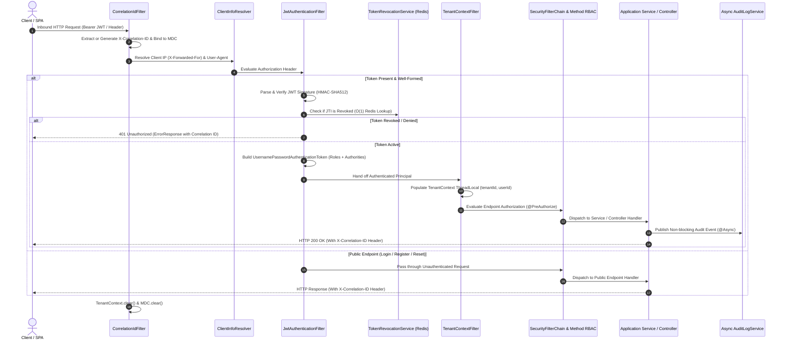
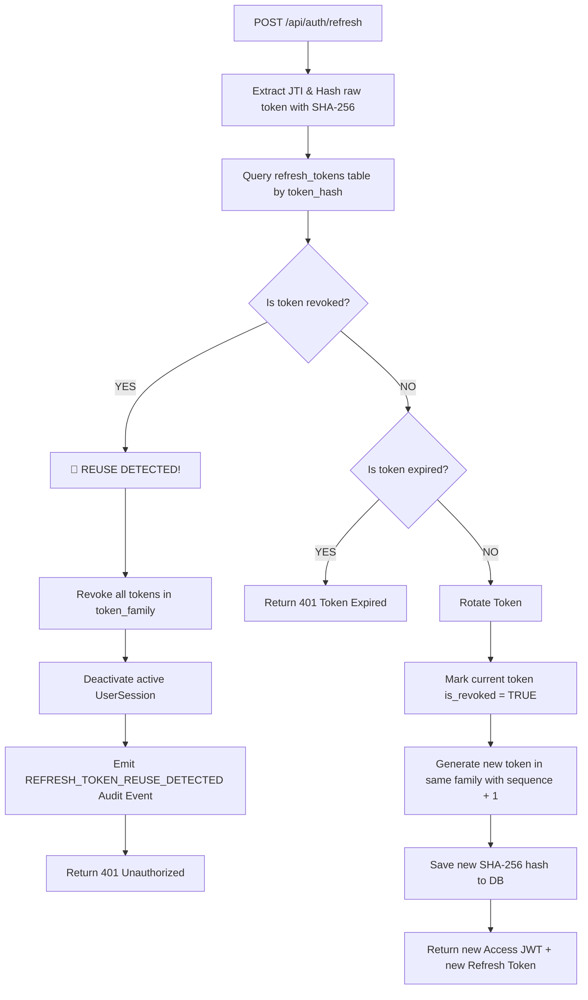
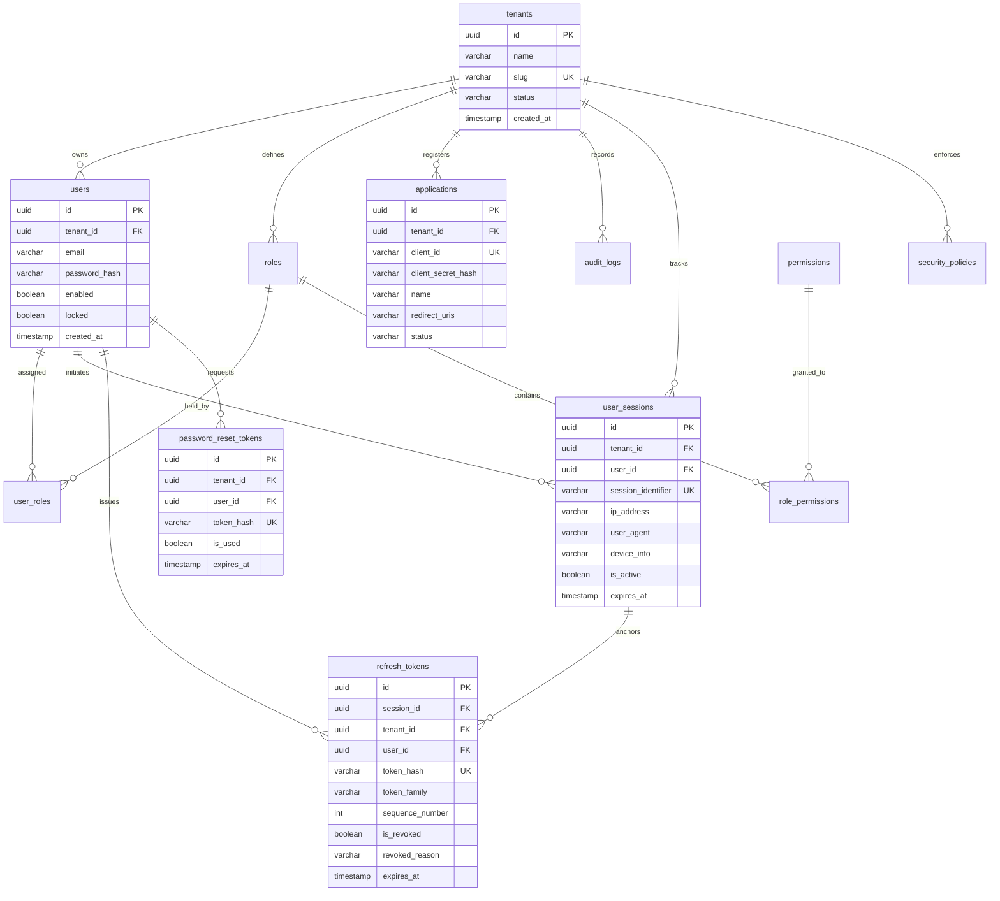

# AccessHub — Enterprise Multi-Tenant Identity & Access Management (IAM) Platform

[](https://oracle.com/java)
[](https://spring.io/projects/spring-boot)
[](https://spring.io/projects/spring-security)
[](https://postgresql.org)
[](https://redis.io)
[](https://flywaydb.org)
[](https://docker.com)
[](LICENSE)

> **AccessHub** is a high-assurance, multi-tenant Identity & Access Management (IAM) and Single Sign-On (SSO) engine built with Java 21, Spring Boot 3.3.4, and Spring Security 6.3. Engineered to deliver enterprise-grade tenant boundary isolation, cryptographic token protection, automated token-family replay detection, distributed dual-bucket rate limiting, and tenant-scoped AI security telemetry analysis.

---

## 📑 Table of Contents
1. [Executive Overview & Architecture Principles](#-executive-overview--architecture-principles)
2. [End-to-End Request Lifecycle](#-end-to-end-request-lifecycle)
3. [Token Family Rotation & Reuse Detection (OAuth 2.1 / RFC 6819)](#-token-family-rotation--reuse-detection)
4. [Multi-Tenant Isolation Architecture](#-multi-tenant-isolation-architecture)
5. [Granular RBAC & Authority Matrix](#-granular-rbac--authority-matrix)
6. [Data Model & Entity-Relationship Schema](#-data-model--entity-relationship-schema)
7. [Enterprise Security Hardening & Threat Model](#-enterprise-security-hardening--threat-model)
8. [Tenant-Isolated AI RAG Security Assistant](#-tenant-isolated-ai-rag-security-assistant)
9. [Why This Is Not Just a CRUD Project](#-why-this-is-not-just-a-crud-project)
10. [Local Development & Docker Deployment](#-local-development--docker-deployment)
11. [Automated Test Suite & Verification](#-automated-test-suite--verification)

---

## 🏛️ Executive Overview & Architecture Principles

AccessHub provides centralized identity governance and authentication services across distributed SaaS applications. It replaces ad-hoc authentication logic with a centralized, hardened security perimeter adhering to zero-trust standards:

- **Zero-Trust Token Storage**: Refresh tokens and password reset tokens are never persisted in plaintext. They are hashed using deterministic SHA-256 before persistence, neutralizing offline database-read exfiltration attacks.
- **Strict Tenant Context Encapsulation**: Multi-tenancy is enforced at the database discriminator level combined with immutable `TenantContext` propagation. No database query across business domains executes without a tenant filter.
- **Observability & Distributed Tracing**: Every inbound HTTP request is assigned a unique `X-Correlation-ID`, bound to SLF4J MDC, recorded across all asynchronous security audit events, and propagated in all client error envelopes.
- **Resilient Distributed State**: Dual-tier rate limiting and token revocation utilize Redis clusters for distributed performance, backed by thread-safe in-memory circuit breakers during infrastructure disruptions.

---

## 🔄 End-to-End Request Lifecycle

Every inbound HTTP request traverses an orchestrated filter pipeline that extracts client metadata, validates cryptographic assertions, isolates tenant identity, and logs telemetry before reaching Spring MVC controllers.



---

## 🔄 Token Family Rotation & Reuse Detection

AccessHub implements **Single-Use Refresh Token Rotation with Token Family Reuse Detection** conforming strictly to **OAuth 2.1 Draft Specifications** and **RFC 6819 Section 5.2.2.3**.



### Attack Mitigation Mechanics
1. **Theft & Interception Defense**: If an adversary intercepts a refresh token and attempts to use it after the legitimate client has already rotated it, the system detects a presentation of an already-revoked token within an active family.
2. **Immediate Blast Radius Quarantine**: Upon detecting reuse, AccessHub immediately revokes **all** tokens belonging to that `token_family`, deactivates the associated `UserSession`, and terminates all active authorizations for that user on that device.
3. **Cryptographic One-Way At-Rest Storage**: Raw refresh tokens are 256-bit URL-safe random secrets. Only the SHA-256 hexadecimal hash is stored in the PostgreSQL database. Even a direct SQL dump will not expose valid refresh credentials.

---

## 🏢 Multi-Tenant Isolation Architecture

AccessHub enforces logical multi-tenancy using a shared-database, shared-schema pattern with discriminator columns (`tenant_id`), fortified by programmatic context propagation and composite unique indexing.

### Isolation Strategy Matrix

| Architectural Layer | Isolation Mechanism | Implementation Detail |
| :--- | :--- | :--- |
| **Transport / HTTP** | `TenantContextFilter` | Intercepts validated JWT claims; binds `tenantId` to thread storage. |
| **Context Management** | `TenantContext` | Thread-safe `ThreadLocal` wrapper; guarantees cleanup in `finally` blocks. |
| **Business Services** | Domain Isolation | Services never accept `tenantId` from untrusted request bodies; it is sourced from `TenantContext`. |
| **Data Access / Repository** | Strict Query Contracts | Every query enforces `findBy...AndTenantId(..., tenantId)`. |
| **Relational Database** | Composite Indexes | Tables enforce composite uniqueness: `UNIQUE(tenant_id, email)`, `UNIQUE(tenant_id, slug)`. |
| **Cache & Key-Value** | Key Namespacing | Redis keys partitioned by tenant: `ratelimit:{tenantId}:{ip}:{email}`. |

### Defense-in-Depth Rationale: Why Repository Contracts over Leaky Connection-Pool RLS
PostgreSQL Row-Level Security (RLS) with connection pooling requires setting session-level configurations (`SET LOCAL app.current_tenant_id`) on each acquired connection. If a connection fails to reset cleanly or an unhandled exception bypasses reset hooks, connection pool poisoning can occur. 

AccessHub enforces tenant isolation directly through the type-safe Spring Data JPA repository layer, coupled with composite database indexing. This provides deterministic isolation, full testability against in-memory engines, and zero dependency on mutable connection session state.

---

## 🔐 Granular RBAC & Authority Matrix

AccessHub implements fine-grained, permission-based Role-Based Access Control (RBAC). Roles are simply collections of granular permissions evaluated via Spring Security's `@PreAuthorize("hasAuthority('...')")`.

### Permission Catalog

| Permission Code | Category | Operational Scope |
| :--- | :--- | :--- |
| `USER_READ` | User Management | Query and view user profiles within the tenant boundary |
| `USER_CREATE` | User Management | Provision new user accounts in the caller's tenant |
| `USER_UPDATE` | User Management | Modify user profiles, update status, lock/unlock accounts |
| `USER_DELETE` | User Management | Hard delete or purge user accounts within the tenant |
| `ROLE_READ` | Role Management | Inspect roles, descriptions, and assigned permissions |
| `ROLE_CREATE` | Role Management | Define custom organizational roles |
| `ROLE_MANAGE` | Role Management | Update permissions associated with tenant roles |
| `ROLE_ASSIGN` | Role Management | Assign or revoke roles from users |
| `PERMISSION_READ` | Role Management | Read global permission catalog |
| `APPLICATION_READ` | Client Applications | View registered OAuth / OIDC client applications |
| `APPLICATION_MANAGE` | Client Applications | Register applications, rotate client secrets, update status |
| `TENANT_MANAGE` | Tenant Administration | Manage organizational settings and tenant lifecycle |
| `AUDIT_READ` | Security Audit | Query historical audit trail, security events, and IP logs |
| `SECURITY_QUERY_AI` | AI Security Telemetry | Query the tenant-isolated RAG security posture assistant |

---

## 🗄️ Data Model & Entity-Relationship Schema



---

## 🛡️ Enterprise Security Hardening & Threat Model

### 1. Timing-Attack & User Enumeration Mitigation
- **Constant-Time Password Comparison**: Login authentication always executes a BCrypt password comparison—even if the targeted username does not exist in the tenant. A dummy BCrypt hash verification is executed to equalize response latency, preventing timing-based user enumeration.
- **Uniform Error Messages**: Both bad passwords and nonexistent usernames return the identical generic error message: `"Invalid email or password"`.
- **Enumeration-Resistant Password Reset**: The `/api/auth/forgot-password` endpoint returns HTTP 200 with an identical message regardless of whether the submitted account exists.

### 2. Strict RFC 3986 Redirect URI Validation
To neutralize Open Redirect vulnerabilities and authorization code interception attacks:
- Protocols must be `HTTPS`, with plain `HTTP` restricted strictly to `localhost` and `127.0.0.1` for local development.
- Wildcards (`*`), path traversal sequences (`..`), userinfo segments (`user:pass@`), and fragment identifiers (`#`) are rejected immediately.
- Candidate URIs during authorization flows are matched against pre-registered client URIs via exact normalized string matching.

### 3. Dual-Bucket Login Rate Limiting & Account Lockout
Brute-force protection uses a dual-bucket strategy backed by Redis with an in-memory circuit-breaker fallback:
- **Bucket 1 (IP Throttling)**: Limits requests from an IP address to 60 requests per minute to stop automated volumetric attacks.
- **Bucket 2 (Account Lockout)**: Tracks consecutive failed logins per `{tenantId}:{email}`. Reaching 5 consecutive failures triggers an automatic 15-minute account lockout and emits a high-priority audit log.

### 4. Single-Use Password Reset Lifecycle
- Generates 256-bit cryptographically secure URL-safe reset tokens.
- Persists only the SHA-256 hash at rest with a strict 15-minute expiration.
- Reset completion immediately marks the token as used, invalidates all existing user reset tokens, and **globally terminates all active user sessions and refresh tokens**.

---

## 🤖 Tenant-Isolated AI RAG Security Assistant

AccessHub embeds a native **Retrieval-Augmented Generation (RAG)** security engine that enables security personnel and tenant administrators to run natural-language security posture audits.

### Tenant Isolation in RAG Pipelines
A critical vulnerability in multi-tenant LLM systems is cross-tenant vector contamination during embedding retrieval. AccessHub prevents this at the query layer:
1. **Pre-Retrieval Tenant Filtering**: When a user queries the AI assistant, the query vector lookup is strictly constrained:
   ```sql
   SELECT * FROM security_policies WHERE tenant_id = :tenantId ORDER BY embedding <=> :queryVector LIMIT 5;
   ```
2. **Audit Telemetry Augmentation**: Recent tenant audit events are appended to the context window strictly filtered by `TenantContext.getTenantId()`.
3. **Zero Leaked Context**: The LLM prompt never receives documentation, roles, or audit trails belonging to any other enterprise organization.

---

## 💡 Why This Is Not Just a CRUD Project

Many identity projects reduce authentication to basic CRUD operations over a user table. AccessHub was architected from the ground up to address the complex edge cases, distributed failure modes, and security challenges of enterprise multi-tenant systems:

### 1. The Token Rotation Concurrency & Race Hazard
In distributed single-page applications, concurrent requests can trigger simultaneous token refresh calls. A naive single-use implementation causes race conditions where valid user sessions are abruptly terminated. AccessHub solves this through:
- Token family tracking with monotonic sequence numbers.
- Atomic state updates within database transactions.
- Grace periods and explicit token reuse detection that cleanly differentiates between an active race condition and malicious replay.

### 2. Eliminating Database-Read Token Theft
Industry standard breaches often involve read-only SQL injection or compromised database snapshots. Storing raw tokens in databases allows attackers to forge sessions immediately. AccessHub implements deterministic SHA-256 token hashing at rest for both refresh tokens and reset tokens—meaning an attacker with a full database dump cannot forge a single valid HTTP session.

### 3. Distributed Resilience with Circuit-Breaking Fallback
Standard rate-limiting tutorials fail completely when Redis encounters network partitions or downtime. AccessHub embeds a circuit-breaker fallback in both `LoginRateLimiterService` and `TokenRevocationService`. If Redis fails, the system logs an alert and falls back to a concurrent, bounded in-memory sliding window, maintaining operational availability without compromising security.

### 4. Defense-in-Depth Cryptographic Secrets
OAuth 2.0 client secrets in AccessHub are treated with the exact same rigor as user passwords. When a client application is registered, the raw secret is displayed **exactly once** to the tenant admin. Only a high-cost BCrypt hash is preserved in the database. During client credentials verification, BCrypt verification prevents offline rainbow table attacks.

---

## 🚀 Local Development & Docker Deployment

### Prerequisites
- **Java 21 JDK** (OpenJDK / Eclipse Temurin / JetBrains Runtime)
- **Maven 3.9+** (or use included `./mvnw`)
- **Docker & Docker Compose**

### 1. Launch Complete Environment via Docker Compose

```bash
# Clone the repository
git clone https://github.com/your-username/SecureSSO.git
cd SecureSSO

# Build and start PostgreSQL 16, Redis 7, and AccessHub IAM API
docker-compose up -d --build
```

The application will start on `http://localhost:8080`.

### 2. Interactive Swagger / OpenAPI Documentation
Access the live, interactive OpenAPI documentation and test API endpoints:
```text
http://localhost:8080/swagger-ui.html
```

### 3. Core API Endpoints

```bash
# 1. Register a new tenant & admin account
curl -X POST http://localhost:8080/api/auth/register \
  -H "Content-Type: application/json" \
  -d '{
    "tenantName": "Acme Aerospace",
    "tenantSlug": "acme",
    "adminEmail": "secops@acme.com",
    "adminPassword": "SuperSecretPassword123!"
  }'

# 2. Authenticate and obtain JWT Token Pair
curl -X POST http://localhost:8080/api/auth/login \
  -H "Content-Type: application/json" \
  -d '{
    "tenantSlug": "acme",
    "email": "secops@acme.com",
    "password": "SuperSecretPassword123!"
  }'

# 3. Rotate Refresh Token
curl -X POST http://localhost:8080/api/auth/refresh \
  -H "Content-Type: application/json" \
  -d '{
    "refreshToken": "<YOUR_REFRESH_TOKEN>"
  }'
```

---

## 🧪 Automated Test Suite & Verification

AccessHub includes a rigorous automated test suite covering cross-tenant data boundaries, token family rotation, replay detection, and account lifecycle security.

### Running Tests

```bash
# Execute entire test suite
./mvnw clean test

# Run specific security integration tests
./mvnw test -Dtest=CrossTenantSecurityIntegrationTest
./mvnw test -Dtest=TokenRotationAndReuseSecurityTest
./mvnw test -Dtest=AccountSecurityIntegrationTest
./mvnw test -Dtest=ApplicationSecurityTest
```

### Integration Test Matrix

| Test Suite | Scenario Verified | Assertions |
| :--- | :--- | :--- |
| `CrossTenantSecurityIntegrationTest` | Cross-Tenant Boundary Violation | Tenant A user attempting to read/modify Tenant B resources receives `403 Forbidden` / `404 Not Found`. |
| `TokenRotationAndReuseSecurityTest` | OAuth 2.1 Token Family Rotation | Successful refresh rotates token. Replaying an old token invalidates full family and active session. |
| `AccountSecurityIntegrationTest` | Password Change & Single-Use Reset | Password change revokes all active sessions. Reset token is single-use and invalidates on reuse. |
| `ApplicationSecurityTest` | OAuth App Registration & Redirect URI | Client secret returned once. Secret rotation updates hash. Open redirect / wildcard URIs rejected. |
| `AuthServiceTest` | Core Authentication Unit Scenarios | Anti-enumeration constant-time login, registration uniqueness, tenant slug validation. |

---

## 📄 License

This project is licensed under the Apache License 2.0. See the [LICENSE](LICENSE) file for details.